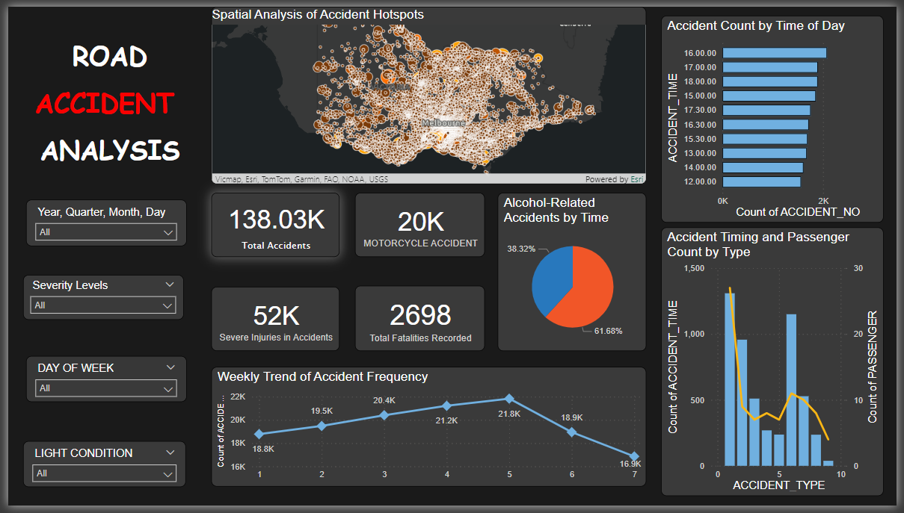

# Road Accident Analysis Dashboard 🚦

## Overview
This project leverages **Power BI** to analyze and visualize road accident data to uncover insights that can aid in improving road safety. The dashboard provides an interactive and comprehensive analysis of road accidents, focusing on key patterns, trends, and severity factors.



---

## Key Features

### 1. Spatial Analysis 🗺️
- Visual representation of accident hotspots across Melbourne.
- Highlights areas requiring targeted safety measures.

### 2. Accident Statistics 📊
- **138K+** total accidents analyzed.
- **20K** motorcycle accidents and **52K** severe injuries recorded.
- **2698 fatalities** highlighted.

### 3. Time-Based Insights ⏰
- Alcohol-related accidents make up **61.68%** of total incidents.
- Peak accident times analyzed to identify critical hours for road safety.

### 4. Weekly Trends 📈
- A detailed weekly trend showcasing accident frequency variations.
- Insights into the correlation between light conditions, time of day, and accident severity.

### 5. Custom Filters 🎛️
- Interactive filters based on:
  - Year, quarter, month, and day.
  - Severity levels.
  - Day of the week.
  - Light conditions.

---

## Visualizations
The dashboard includes:
- **Heatmaps**: Spatial distribution of accident hotspots.
- **Pie Charts**: Alcohol-related accidents proportion.
- **Bar Graphs**: Accident count by time of day and type.
- **Line Charts**: Weekly accident trends.

---

## Tools Used 🛠️
- **Power BI**: For data analysis and visualization.
- **Data Sources**: Road accident data (specific details can be added here if necessary).

---

## Repository Contents 📂
- **/Dashboard_Screenshots**: Visuals of the Power BI dashboard.
- **/Data**: Sample data used for this analysis.
- **/Documentation**: Steps and methods for replicating this project.

---

## How to Contribute 🤝
1. Fork the repository.
2. Clone it to your local machine.
3. Make your changes and create a pull request.

---

## Installation and Setup 🖥️
1. Clone the repository:
   ```bash
   git clone <repository-link>
   ```
2. Import the dataset into Power BI.
3. Use the provided `.pbix` file to view or modify the dashboard.

---

## Contact 📧
Feel free to reach out for collaboration or feedback:
- **Email**: work.vinayakvatahre@gmail.com
- **LinkedIn**: https://www.linkedin.com/in/vinayak-vathare-4bb135279/

---

## Open for Contributions 🌟
This project is a work in progress! Suggestions and contributions are welcome to enhance the analysis and visualizations. Let's collaborate to make roads safer for everyone! 

---
